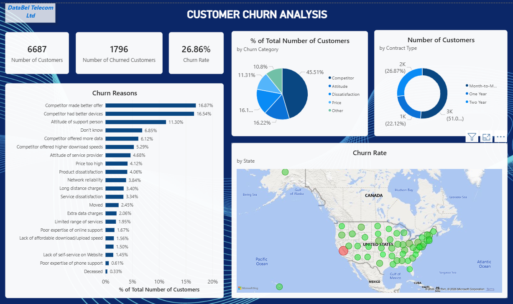
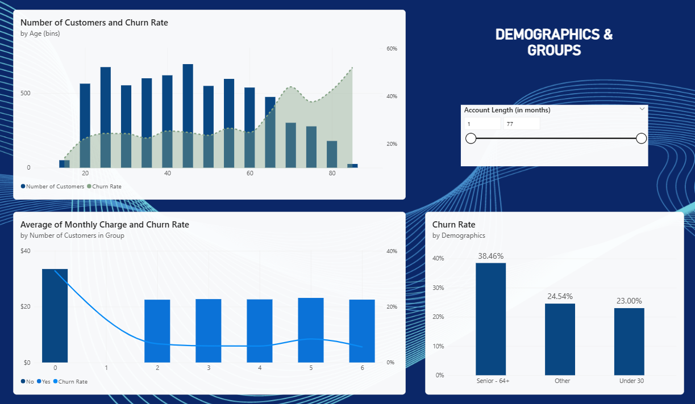
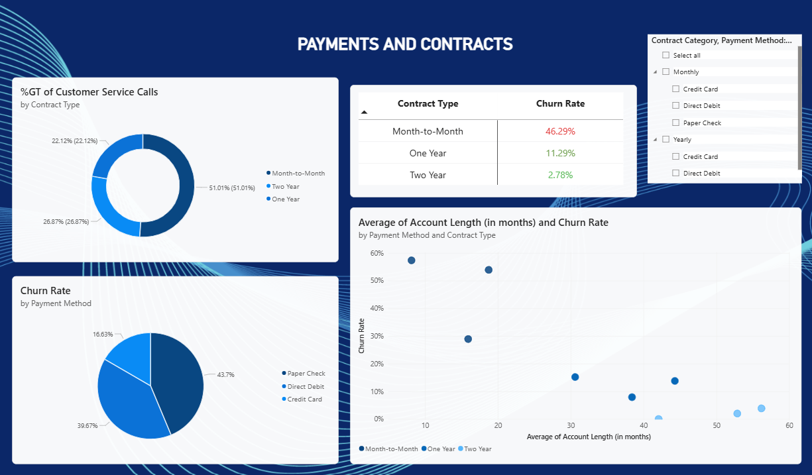
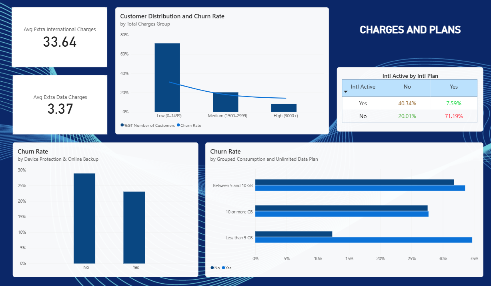
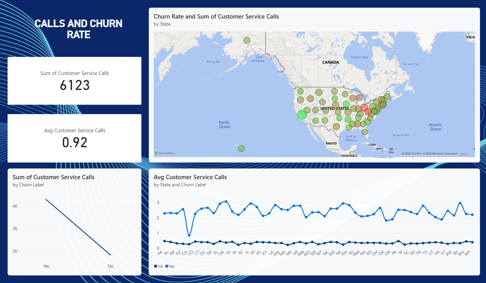

# databel-customer-churn-analysis

## Overview
This Power BI project analyses customer churn for **Databel**, a fictional telecom company dataset provided by DataCamp. The project explores churn patterns across demographics, contract types, payment methods, service plans, and customer service behaviour — culminating in actionable retention recommendations.

> **Note:** This dataset is fictional and created for educational and portfolio purposes by DataCamp. It does not represent real customer data.

---

## 📋 Table of Contents
- [Folder Structure](#-folder-structure)
- [Dataset Description](#-dataset-description)
- [Project Objectives](#-project-objectives)
- [Tools & Technologies Used](#-tools--technologies-used)
- [Data Transformation](#data-transformation)
- [DAX Measures](#dax-measures)
- [Dashboard Pages](#dashboard-pages)
- [Key Findings & Recommendations](#-key-findings--recommendations)
- [How to Open the Dashboard](#️-how-to-open-the-dashboard)
- [Author](#-author)

---

## 📁 Folder Structure

```
databel-churn-analysis/
│
├── data/
│   └── databel_customer_data.xlsx
│
├── dashboard/
│   └── databel_churn_dashboard.pbix
│
├── screenshots/
│   ├── page1_overview.png
│   ├── page2_demographics.png
│   ├── page3_payments_contracts.png
│   ├── page4_charges_plans.png
│   └── page5_customer_service.png
│
└── README.md
```

---

## 📊 Dataset Description

The dataset represents a fictional telecom company and includes information such as:

- Customer demographics (age, senior status)
- Contract and subscription details
- Service usage patterns
- International plan usage
- Add-on services (e.g., device protection, online backup)
- Monthly and total charges
- Churn status (Yes/No)

---

## 🎯 Project Objectives

- Analyse overall churn rate and key contributing factors
- Identify high-risk customer segments
- Evaluate the impact of contract types and payment methods
- Understand the role of service usage and add-ons in churn
- Provide actionable recommendations to improve customer retention

---

## 🛠 Tools & Technologies Used

- **Power BI Desktop** — Data modelling & visualisation
- **Power Query Editor** — Data validation & transformation
- **DAX** — Measure and column calculations
- **Microsoft Excel** — Source data format

---

## Data Transformation

The dataset was imported from a pre-cleaned Excel file. The following validation and transformation steps were performed in Power Query Editor:

### Data Validation

- Verified column data types (text, whole number, decimal, boolean)
- Confirmed no null or missing values across all columns using the Power BI **Column Quality** feature
- Renamed columns and rephrased column values for consistency and readability
- Validated categorical columns (e.g., Intl Plan: "yes/no", Churn Label: "yes/no")
- Checked for duplicate rows — none found
- Confirmed numeric columns (e.g., Total Charges, Customer Service Calls) had no negative or outlier values using the Power BI **Column Profile** feature

### Custom Columns Created

| Column Name | Logic | Purpose |
|---|---|---|
| Churned | `IF([Churn Label] = "Yes", 1, 0)` | To calculate churn rate numerically |
| Demographics | `IF([Senior]="Yes","Senior - 64+", IF([Under 30]="Yes","Under 30","Other"))` | To combine separate age columns into a single segment |
| Age (bins) | Created using Power BI **New Group** feature | To understand churn distribution across age bands |
| Contract Category | `SWITCH([Contract Type],"Month-to-Month","Monthly","Yearly")` | To consolidate 1-year and 2-year contracts into a single "Yearly" category |
| Grouped Consumption | `IF([Avg Monthly GB Download]<5,"Less than 5 GB", IF([Avg Monthly GB Download]<10,"Between 5 and 10 GB","10 or more GB"))` | To categorise customers by data consumption level |
| Total Charges Group | `IF([Total Charges]<1500,"Low (0–1499)", IF([Total Charges]<3000,"Medium (1500–2999)","High (3000+)"))` | To categorise customers by total spend tier |

---

## DAX Measures

All measures were stored in a dedicated empty table to keep the data model organised:

```DAX
_Calculations = DATATABLE("Column", STRING, {{"Dummy"}})
```

---

### Number of Customers
```DAX
Number of Customers = 
COUNT('Databel'[Customer ID])
```
*Returns the total number of customers in the dataset.*

---

### Number of Churned Customers
```DAX
Number of Churned Customers = 
SUM(Databel[Churned])
```
*Counts only customers who churned using the custom numeric Churned column.*

---

### Churn Rate
```DAX
Churn Rate = 
DIVIDE([Number of Churned Customers], [Number of Customers])
```
*Calculates the overall percentage of customers who churned.*

---

### Average Customer Service Calls
```DAX
Avg Customer Service Calls = 
AVERAGE(Databel[Customer Service Calls])
```
*Calculates the average number of customer service calls made per customer.*

---

### Average Extra Data Charges
```DAX
Avg Extra Data Charges = 
SUM(Databel[Extra Data Charges]) / [Number of Customers]
```
*Calculates the average extra data charges incurred per customer.*

---

### Average Extra International Charges
```DAX
Avg Extra International Charges = 
SUM(Databel[Extra International Charges]) / [Number of Customers]
```
*Calculates the average extra international charges incurred per customer.*

---

## Dashboard Pages

### Page 1 — Overview
High-level summary of overall churn rate, total customers, churned customers, and top churn reasons. Includes churn rate by state displayed through KPI cards, charts, and a map visual.



---

### Page 2 — Customer Demographics
Churn breakdown by demographics, group plan participation, and age bins. Includes a slicer filter on account length to identify high-risk demographic segments.



---

### Page 3 — Payment & Contracts
Churn patterns across payment methods and contract types to identify behavioural and financial trends linked to retention.



---

### Page 4 — Charges & Plans
Analysis of churn across international plans, unlimited plans, device protection and online backup subscriptions, and data consumption groups.



---

### Page 5 — Customer Service Calls & Churn
Explores the relationship between churn and the number of customer service calls. Includes a geographic breakdown of service call frequency across all states.



---

## 📈 Key Findings & Recommendations

| # | Finding | Recommendation |
|---|---|---|
| 1 | Overall churn rate is **26.86%** | Launch targeted retention strategies across high-risk segments |
| 2 | **California** has the highest churn rate (**63.24%**) | Launch a California-specific retention programme |
| 3 | ~45% churned due to **competitor offers and devices** | Strengthen competitive value proposition and loyalty upgrades |
| 4 | **Monthly contract customers** show highest churn (**51%**) | Incentivise migration to long-term contracts |
| 5 | Customers **not in a group plan** churn at **32.85%** | Drive group plan adoption among individual subscribers |
| 6 | **Senior customers** churn at **38.46%** | Develop a dedicated senior customer retention strategy |
| 7 | **Paper check users** have the highest churn | Migrate customers to automated payment methods |
| 8 | **Low charges group (0–1499)** has highest churn (**30.98%**) | Implement proactive engagement for low-spend customers |
| 9 | **Unlimited plan** customers churn across all usage levels | Re-evaluate unlimited plan positioning and segmentation |
| 10 | **International plan with no active usage** churns at **71.19%** | Proactively optimise international plans for non-users |
| 11 | Absence of **device protection & online backup** linked to churn | Bundle add-on services into standard plans |
| 12 | Churned customers made **more customer service calls** | Build an early warning system using service call data |

> Detailed analysis and expected business impact are documented in the Project Report.

---

## 🖥 How to Open the Dashboard

1. Download and install [Power BI Desktop](https://powerbi.microsoft.com/desktop/) *(free)*
2. Clone or download this repository
3. Open the `dashboard/databel_churn_dashboard.pbix` file in Power BI Desktop
4. The dataset is embedded — no additional setup required
5. Navigate through report pages using the tabs at the bottom of the screen

> Built using Power BI Desktop (2026). Some visuals may render differently on older versions.

---

## 👤 Author

Created as part of a Power BI Data Analytics Portfolio Project.
